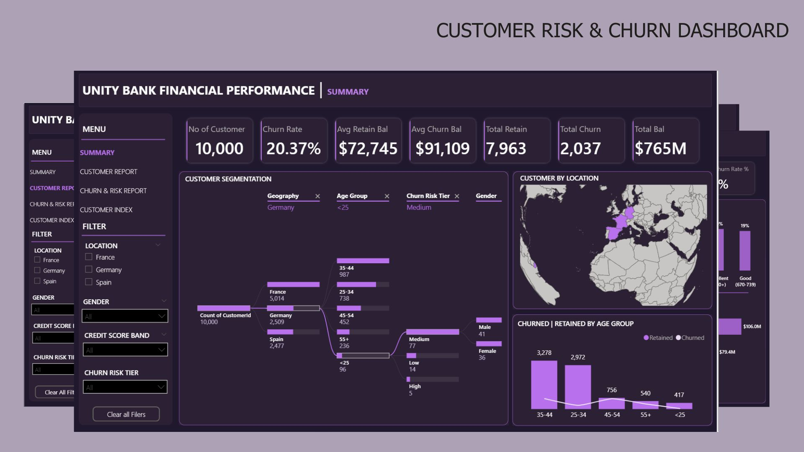

# PowerBI_Financial_Performance_Customer_Churn_Analytics

  

---

## Business Overview
**Unity Bank** is a financial services institution operating across multiple European markets, including France, Germany, and Spain. The bank serves a diverse customer base with varying financial profiles, credit quality, and engagement levels. It also offers a variety of banking products across consumer and business segments. As part of its digital transformation and customer-centric strategy, the bank aims to strengthen data-driven decision-making across customer engagement, financial performance, and operational risk management.

To support data‑driven decision-making, Unity Bank implemented a PowerBI analytics solution focused on **customer behavior, churn risk, financial exposure, and portfolio performance**. The dashboards enable stakeholders to monitor customer retention, identify high-risk and high-value customers, analyze churn drivers, and evaluate how customer demographics, credit profiles, and product usage influence churn.

---

## Business Problem 
As competition in the banking sector intensifies and customer switching costs increase, **Unity Bank** faces growing pressure to retain customers, protect high-value balances, and proactively manage churn risk.

**1. High Customer Churn with Significant Financial Impact**
- The bank is experiencing a churn rate of over 20%, resulting in the loss of 2,037 customers.
- Churned customers account for approximately $186M in lost balances, posing a serious threat to revenue stability.

**2. Loss of High-Value Customers**
- The high-value churn rate (~25%) indicates that customers with substantial balances are leaving at a disproportionate rate.
- Average churned balances are higher than retained balances, increasing financial exposure.

**3. Inactivity as a Major Churn Driver**
- A large share of churn originates from inactive customers, highlighting poor engagement and weak lifecycle management.
- The bank lacks early-warning indicators to intervene before customers disengage.

**4. Geographic Concentration of Churn Risk**
- Certain regions (notably Germany) show significantly higher churn rates and churned balances.
- Regional performance disparities make it difficult to deploy uniform retention strategies.

**5. Low Product Penetration and Weak Customer Stickiness**
- Most customers hold only one product, increasing churn susceptibility.
- Customers with fewer products show higher churn likelihood compared to multi-product customers.

**6. Underestimated Risk in Medium-Risk Customers**
- The majority of churned balances come from customers classified as Medium Risk, not High Risk.
- This indicates gaps in the bank’s churn risk classification and prioritization logic.

---

## Project Objectives
The PowerBI project was designed to achieve the following objectives:

**1. Provide a Unified View of Customer Churn and Risk**
- Develop interactive dashboards that track churn rate, churned balances, risk tiers, and customer activity status in real time.

**2. Identify High-Risk and High-Value Customers**
- Enable business users to quickly isolate customers who combine high balances with elevated churn risk for proactive intervention.

**3. Analyze Churn Drivers Across Key Dimensions**

Assess churn patterns by:
- Geography
- Age group
- Credit score band
- Product usage
- Active vs. inactive status

**4. Support Targeted Retention Strategies**

Equip relationship managers and marketing teams with insights to design segment-specific retention actions, especially for:
- Medium-risk customers
- Inactive customers
- Single-product customers
- Older age segments (45+)

**5. Improve Financial Risk Visibility**
- Quantify the financial exposure of churn by risk tier and customer segment.
- Shift focus from churn volume alone to churn value impact.

**6. Enable Customer-Level Monitoring**
- Provide a customer portfolio view to track individual balances, credit scores, risk tiers, and churn status.
- Support operational decision-making at both strategic and tactical levels.

---

## Data Dictionary and Modelling
- **CustomerID:** Unique customer identifier
- **Surname:** Customer full name (for identification in the portfolio view)
- **CreditScore:** Actual credit score used for segmentation 
- **Geography:** Country of customer (France, Germany, Spain)
- **Gender:** Customer gender (Male, Female)
- **Age:** Exact age of customer
- **Tenure:** How long they have been using the banking service(s)
- **Balance:** Current total account balance held by the customer
- **NumOfProducts:** Number of bank products held by the customer (1–4)
- **HasCrCard:** Indicates if the customer has a credit card (Yes/No)
- **IsActiveMembers:** Indicates if the customer is currently active or inactive
- **EstimatedSalary:** Customer's annual salary
- **Exited:** Indicates if the customer has churned (Yes/No)
- **Age Group:** Customer age category (<25, 25–34, 35–44, 45–54, 55+)
- **CreditScore Band:** Customer credit score range (Poor, Fair, Good, Very Good, Excellent)
- **Churn Risk Score:** Scored risk level (e.g., 0–4 scale) for finer segmentation
- **Balance Band:** Categorized balance ranges (e.g., Low < $50K, Medium $50K–100K, etc.)
- **Churn Risk Tier:** Risk level assigned based on customer behavior or model (Low, Medium, High)

  

---

## Approach & Methodology
This project was developed entirely using **Microsoft PowerBI**, covering the full analytics workflow — from data cleaning and transformation to modeling, analysis, and visualization. The objective was to analyze customer behavior, churn risk, and portfolio insights using an integrated and interactive PowerBI dashboard solution.
### 1️⃣ Data Cleaning & Transformation (Power BI Power Query)
- Imported raw customer data into **Power BI** using Power Query Editor
- Performed data cleaning and transformation directly in Power BI:
  - Removed duplicates and filtered invalid or missing entries
  - Renamed columns and standardized field formats (e.g., text, numeric, dates)
  - Created **calculated columns** for:
    - `Age Group` (e.g., <25, 25–34, 35–44, etc.)
    - `Credit Score Band` (e.g., Poor, Fair, Good, etc.)
    - `Balance Band` (e.g., Low < $50K, Medium, High, Very High)
    - `Churn Risk Tier` (Low, Medium, High)
    - `Churn Risk Score` (0,1,2,3,4,5)
  - Ensured consistency and data quality for downstream modeling

### 2️⃣ DAX Measures (Power BI)
- Created **custom DAX measures** to support key metrics and business logic, including:
  - `Churn Rate`, `Total Customers`, `Churned Balance`, `Average Churned Balance`, `Average Retained Balance`, etc
- Used **DAX functions** such as:
  - `CALCULATE`, `FILTER`, `DIVIDE`, `AVERAGEX`, `IF`, `VAR`, `COUNTROWS`, `DISTINCTCOUNT`, etc
- Applied calculated measures to support dynamic and filter-aware analysis across customer segments

### 3️⃣ Interactive Visualization & Dashboard Design (Power BI)
Developed a comprehensive suite of interactive dashboards using **Power BI Desktop**

**Visualization Techniques:**
- Used card visuals, bar/column charts, donut charts, heatmaps, and filters/slicers
- Enabled interactive drill-downs by age, region, churn status, and risk score

### 4️⃣ Insight Generation & Business Alignment
- Identified key customer behavior patterns
- Translated findings into **actionable business recommendations**

---

## 🔢 Customer Overview
### Top KPIs (Key Performance Indicators)
- Total Customers: 10,000
- Average Balance: $76,486
- Products per Customer: 1.53 on average
- Active Customers: 51.51%
- Median Credit Score: 652

### 📊 Customer Segmentation: Analysis & Insights
**1. By Location**
- France has 50% (5,014) of the total customers.
- Germany and Spain are almost equally represented (~25% each).

**2. By Age Group & Gender**
- Largest age segments:
   - 35–44: 3,981 customers
   - 25–34: 3,222 customers
- Younger segment (<25) is the smallest: only 457 customers
- Gender distribution is balanced across all age groups

**3. By Credit Score Band**
- Majority of customers have fair to poor credit:
   - Fair (580–669): 3,331 customers
   - Poor (<580): 2,362 customers
   - Good (670–739): 2,428 customers
- Only 655 customers have Excellent (800+) scores - just 6.5% of the base

**4. By Number of Products**
- Over 50% have only 1 product
  - 5,084 (1 product)
  - 4,590 (2 products)
- Very few are using 3+ products

**5. By Balance Band**
- High Balance (100k–150k): 3,830 customers
- Low Balance (<50k): 3,692 customers
- Medium (50k-100k): 1,509 customers
- Very High Balance (150k+): 969 customers
- Most balances are clustered at the extremes - either low or high, suggesting a bimodal distribution

### ⚠️ Key Challenges Identified
**1. Low Active Engagement**
- With only 51.51% active customers, nearly half of the customer base is disengaged or dormant.
  - This may contribute significantly to the 20.37% churn rate.

**2. Low Cross-Sell Penetration**
- Over 95% of customers have 1–2 products
  - Suggests missed opportunities for upselling/cross-selling additional financial services (loans, credit cards, investments, etc.)

**3. Weak Credit Quality**
- With a median credit score of 652 and 5,693 customers in Fair or Poor segments, the bank may be carrying higher credit risk.
  - Could impact loan default rates and profitability if not managed

  

  
### 2) Rate of turnover per department
**Analysis & Insight:**
- **Engineering** is experiencing severe retention challenges with a turnover rate of **150%**, meaning more employees left than the department currently employs, a clear indicator of serious issues related to workload, leadership, or job satisfaction.
- **Marketing (64%)** and **HR (54%)** also show elevated turnover, suggesting instability and potential disengagement.
- In contrast, **Sales** has a turnover rate of just **13%**, making it the most stable department and a strong benchmark for effective people management and retention practices.

  

### 3) Top 3 employees at risk of leaving base on their performance
**Analysis & Insight:**
- **Grace Wilson** has the lowest average performance score at **3.43**, followed by **Jane Wilson (3.58)** and **Eve Davis (3.65)**, all below the team average.
- These lower scores indicate potential challenges with role fit, workload, or support, making these employees more vulnerable to disengagement and potential attrition.
- Without targeted intervention, their performance gaps could translate into increased turnover risk and lost productivity.

  

### 4) Top reasons why employees are leaving 
**Analysis & Insight:**
- The most common reason for employee departures is **personal reasons (11 exits)**, indicating a need for more flexible working arrangements and stronger employee support.
- **7** employees left for other **job opportunities**, suggesting competitive pressures related to pay, engagement, or career development.
- **Career growth limitations (5 exits)** and **retirements (5 exits)** also contribute meaningfully to turnover, highlighting gaps in progression planning and succession management.

  

### 5) Number of employees that left 
**Analysis & Insight:**
- A total of **28 employee separations** indicates a meaningful level of turnover that is likely impacting productivity, team continuity, and recruitment costs.
- When combined with department-level data, this volume of exits highlights particularly strong retention challenges within **Engineering, Marketing, and HR,** reinforcing the need for targeted engagement and retention strategies.

  

---

## Employee Performance Analysis
### 1) Number of employees with a performance score of 5.0
**Analysis & Insight:** 
- No employee achieved the maximum performance score of **5.0**, indicating that **top-tier performance is not currently being reached** across the organization.
- This suggests potential gaps in performance expectations, goal clarity, training, or employee support, which may be limiting overall productivity and engagement.

  

  
### 2) Number of employees with a performance score below 3.5
**Analysis & Insight:**
- Only **one employee** has an average performance score **below 3.5**, indicating an early performance risk.
- While limited in scale, this outlier could signal potential disengagement or skill gaps that, if left unaddressed, may impact productivity and increase the likelihood of future turnover.

  

### 3) Department with the most employees, with a performance of 5.0
**Analysis & Insight:**
- No department achieved an average performance score of **5.0**, indicating that **top-tier performance is not being reached at the team level**.
- While individual employees may perform well, the lack of consistently high departmental averages suggests potential gaps in team alignment, KPI clarity, training, or leadership effectiveness

  

### 4) Department with the most employees with a performance score below 3.5 
**Analysis & Insight:**
- No department has an average performance score below **3.5**, indicating that **performance challenges are not systemic** and are largely limited to individual employees rather than entire teams.
- This suggests that departmental leadership, training, and operational structures are generally effective and support consistent performance across the organization.

  

### 5) Average performance score by department
**Analysis & Insight:**
- Departmental performance is highly consistent, with average scores ranging from **4.00 to 4.13**, indicating stable and balanced team performance across the organization.
- **Marketing** leads slightly within this range, suggesting effective practices that could be shared across other teams, while **Sales**, at the lower end, may benefit from additional support such as clearer KPIs, updated tools, or refresher training.

  

---

## Salary Analysis
### 1) Total salary expense of NextGen Corp
**Analysis & Insight:** 
- NextGen Corp’s total salary expenditure is **$4,850,000**, representing a significant investment in its workforce and the company’s highest ongoing operational cost.
- Given the scale of this spend, even small improvements in **retention, performance, or compensation alignment** can generate substantial financial impact and improve overall return on investment in human capital.

  

  
### 2) Average salary by job title
**Analysis & Insight:**
- The **Sales Representative** role has the highest average salary at **$84,285.71**, reflecting strong revenue-driven incentives and the importance of frontline sales performance.
- **HR Specialists** follow closely at **$81,818.18**, highlighting the company’s investment in talent management and employee relations.
- Both **Engineers** and **Sales Managers** earn an average of **$80,000**, showing parity between technical expertise and sales leadership.
- **Marketing Specialists** have the lowest average at **$77,857.14**, indicating competitive but comparatively lower compensation within the organization.

  

### 3) How many employees earn above $80,000
**Analysis & Insight:**
- A total of **26 employees** earn more than **$80,000**, indicating a strong concentration of senior, specialized, and high-impact roles within NextGen Corp.
- This reflects a **competitive compensation structure** designed to attract and retain top talent in critical functions such as sales, engineering, and HR leadership.

  

### 4) How does performance correlate with salary across departments 
**Analysis & Insight:**
- **Marketing** has the highest total salary spend at **$253.9M** and also the highest average performance score **(4.13)**, indicating a strong return on compensation investment.
- **Engineering** delivers the second-highest performance **(4.10)** with a significantly lower salary cost **($192M)**, making it one of the most cost-efficient teams.
- **HR** maintains solid performance **(4.05)** with a low total salary of **$49.8M**, reflecting efficient workforce management.
- **Sales**, with a salary cost of **$24.36M** and the lowest performance score **(4.00)**, shows the greatest opportunity for performance improvement through enhanced training, incentives, or tools.

  

---

## Recommendations
### Employee Experience & Engagement
1. **Enhance Employee Support Programs**

Offer wellness initiatives, stress management resources, family-care policies, and flexible schedules to reduce personal-life attrition.

2. **Build a Positive Culture of Recognition**

Introduce employee appreciation programs, spotlight achievements, and award exceptional contributions to boost morale.

3. **Improve Internal Mobility**

Allow employees to move across teams or departments before seeking external opportunities.

4. **Create Employee Listening Channels**

Quarterly surveys, HR open-door policies, and manager check-ins to address issues early.

### Performance Management
1. **Standardize Performance Evaluation**

Implement consistent, bias-free performance criteria across all departments to ensure fair and reliable assessments.

2. **Support Low Performers Early**

Provide targeted coaching for employees with performance scores below 3.5, supported by clear improvement plans and measurable milestones.

3. **Build a High-Performance Culture**

Introduce department-level KPIs, expand coaching programs, and offer continuous upskilling to move average performance closer to top-tier benchmarks.

4. **Establish Performance-Based Rewards**

Introduce bonuses, recognition programs, and leadership opportunities to motivate high performers and reinforce strong performance trends.

### Turnover & Retention
1. **Targeted Departments Support**

Engineering, HR, and Marketing show high turnover; prioritize these departments for retention programs, workload assessments, and leadership coaching.

2. **Exit Interview Insights**

Formalize structured exit interviews to uncover root causes behind personal reasons, career growth gaps, and employees finding better jobs.

 3. **Reduce Personal-Reason Turnover**

Offer flexible work arrangements, improved leave policies, and wellness support to address personal-life–related exits.

4. **Strengthen Career Development**

Many employees left for “career growth”; create clearer promotion pathways, mentorship programs, and skill development plans.

### Salary & Compensation
1. **Conduct salary benchmarking**

Compare current salaries with industry standards to ensure competitiveness across all roles, especially marketing specialists and technical roles (engineers).

2. **Review compensation alignment**

Align salary levels with job responsibilities and performance outcomes to maintain fairness and prevent pay inequities.

3. **Strengthen incentive structures**

Maintain strong incentives for sales roles and consider performance-based bonuses for marketing, engineering, and HR to boost motivation.

4. **Build a clear salary progression framework**

Implement transparent salary ranges and growth paths so employees understand how performance and tenure lead to pay increases.

---

### Department-specific Recommendations
1. **Engineering (critical attention needed)**
- Address causes of 150% turnover: conduct workload audits, enhance leadership support, and improve team morale.
- Offer technical training and recognition programs to boost satisfaction.
2. **Marketing & HR (high turnover areas)**
- Strengthen employee support and engagement.
- Clarify role expectations, career paths, and growth opportunities.
- Reassess workload distribution and team structure.
3. **Sales (strong retention & stability)**
- Analyze and document sales’ successful retention strategies, leadership style, incentives, onboarding, and replicate what works across other departments.
4. **Company-wide**
- Ensure each department receives a tailored retention and performance plan based on turnover rate and average performance score.

---

## Executive Summary
This report analyzes employee performance, compensation, and turnover trends at NextGen Corp to identify risks and opportunities impacting workforce stability and organizational growth. The findings highlight significant retention challenges in Engineering, HR, and Marketing, contrasted with strong stability in Sales. While performance levels are generally consistent across departments, no team has yet reached top-tier performance, indicating opportunities to strengthen performance management and employee development.

Compensation analysis reveals uneven salary distribution across roles, suggesting the need for better alignment with responsibilities, performance, and market benchmarks. Based on these insights, the report recommends targeted retention initiatives, standardized performance evaluation, competitive and equitable pay structures, and stronger employee support programs.

Implementing these actions will help NextGen Corp improve retention, boost productivity, and build a more resilient, high-performing workforce.

---

## Disclaimer
This project is for portfolio and educational display only.

No content may be reused without permission.

---

## Connect With Me
- 💼 **LinkedIn:** (https://www.linkedin.com/in/david-okeleye001/)
- 📧 **Email:** okeleyedavid2021@gmail.com
- 🌐 **Portfolio:** https://bit.ly/3N5c1p7
- 🐙 **GitHub:** https://github.com/olavidz01-dev
